# React Module 2 PWA

## Project: Note

#### [moby home page]

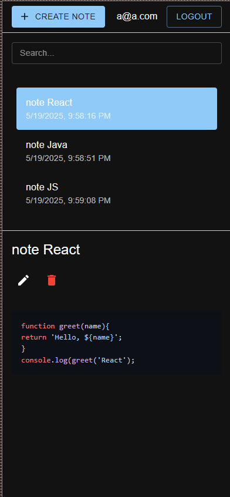

#### [moby create page]

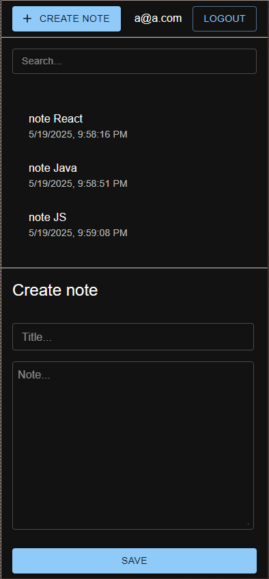

#### [home page]

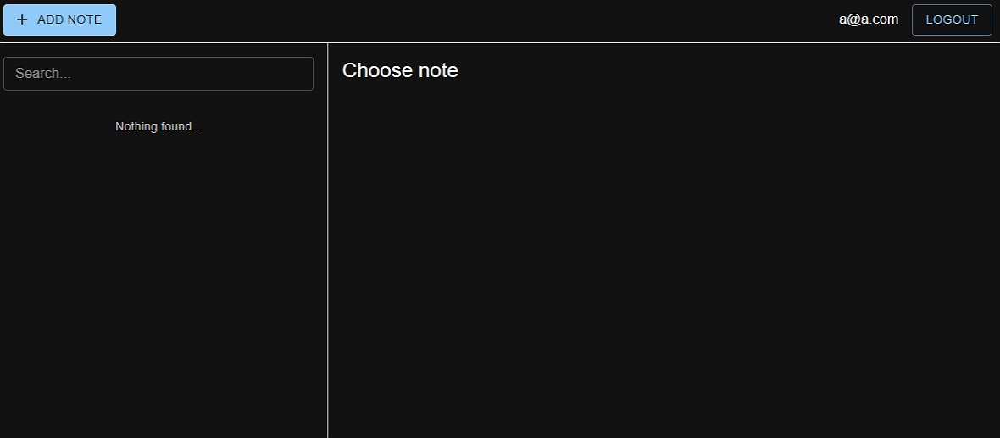

#### [register page]

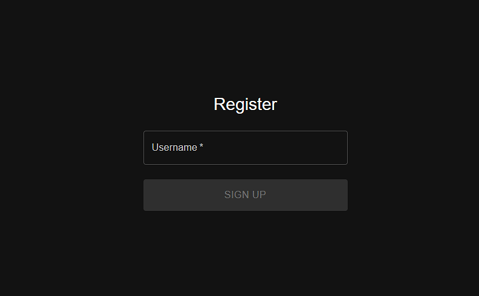

#### [log in page]

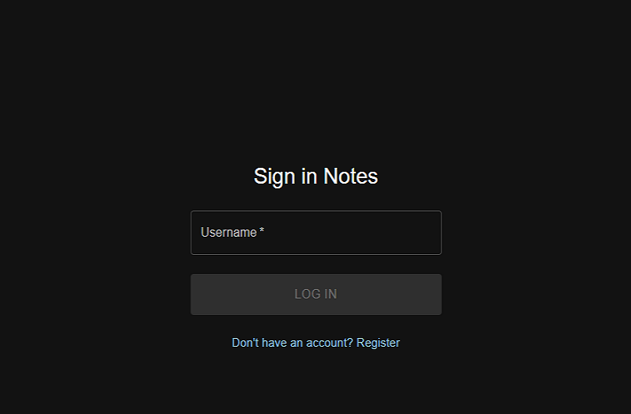

#### [log in page]

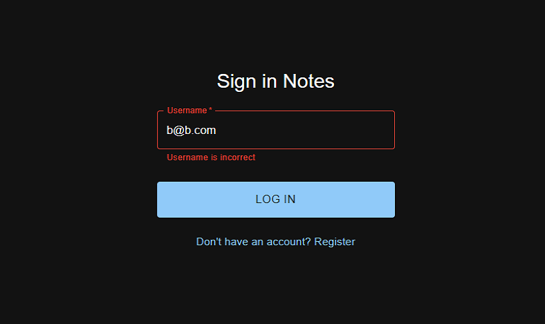

#### [add 1 page]

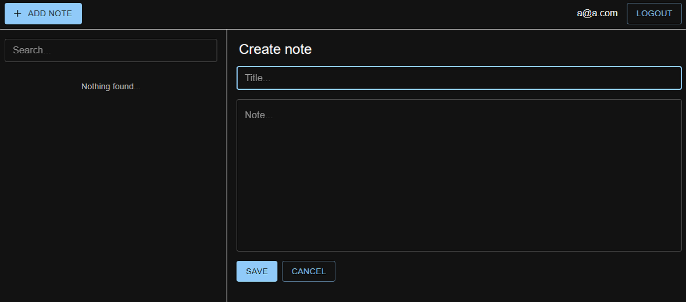

#### [add 2 page]

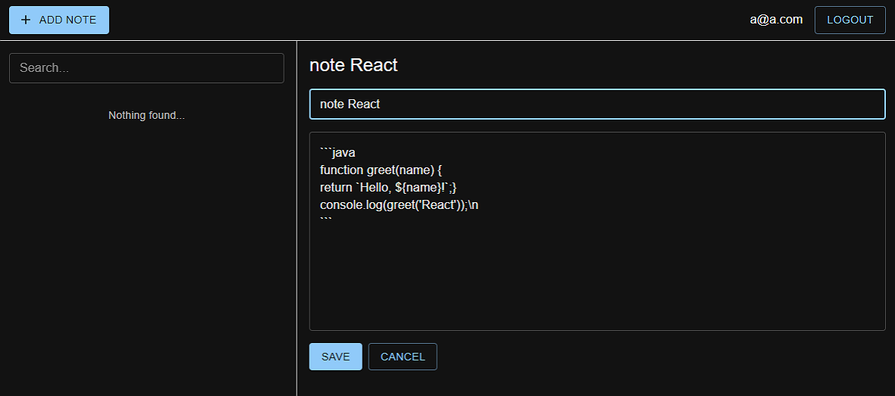

#### [add 3 page]

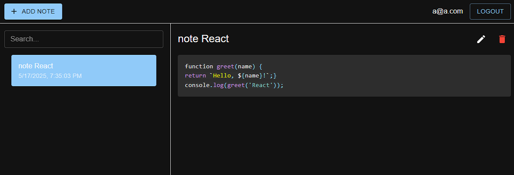

#### [edit page]

#### [list page]

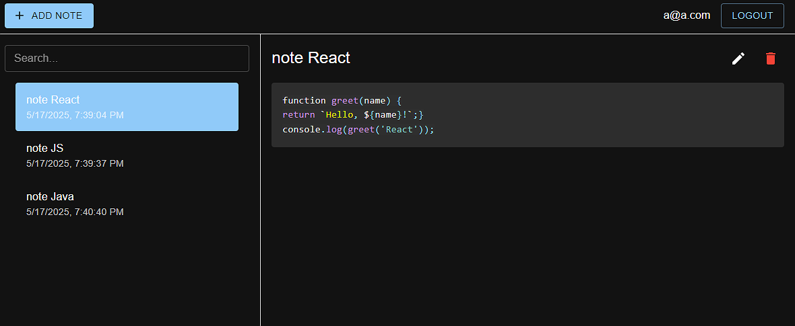

#### [search page]

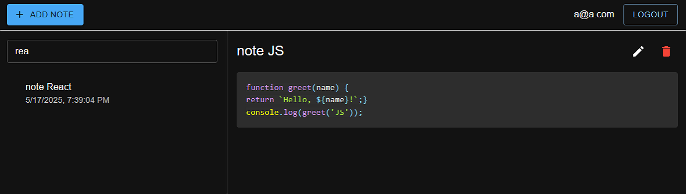

#### [manifest]

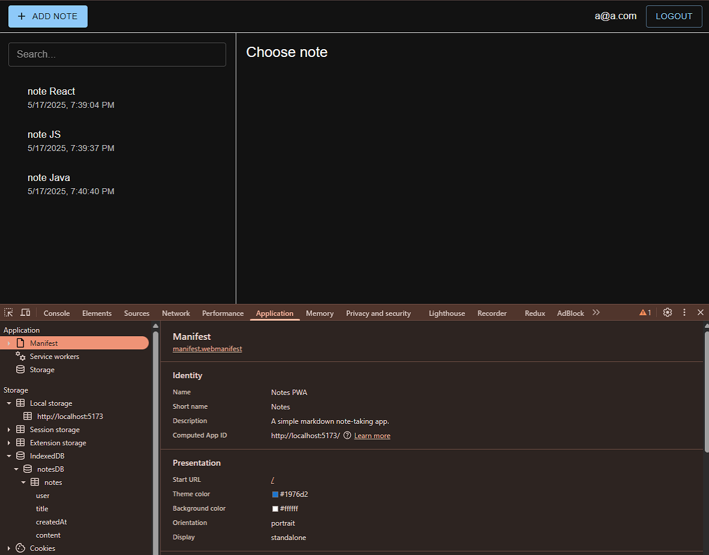

#### [sw]

#### [local storage]

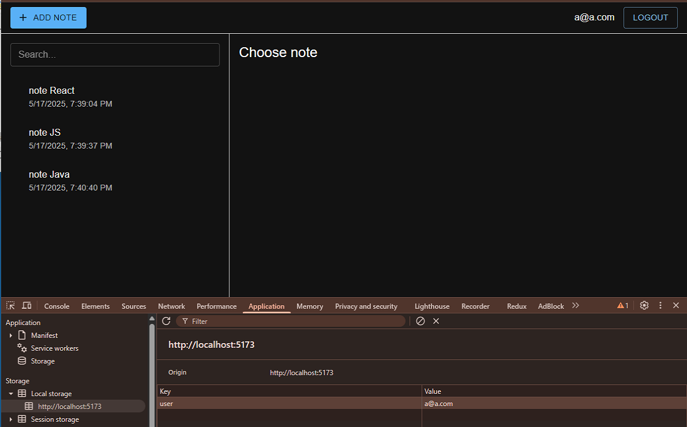

#### [db]

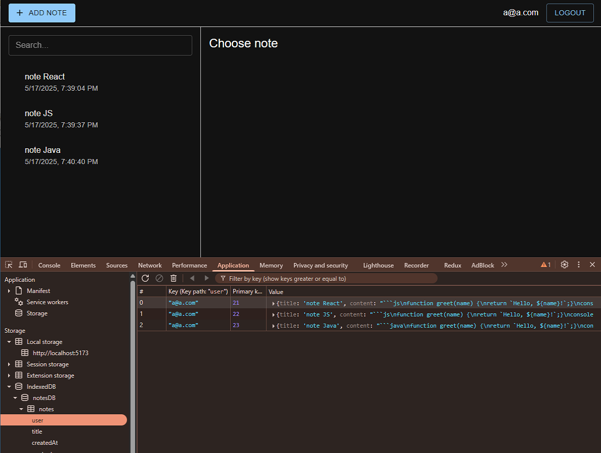