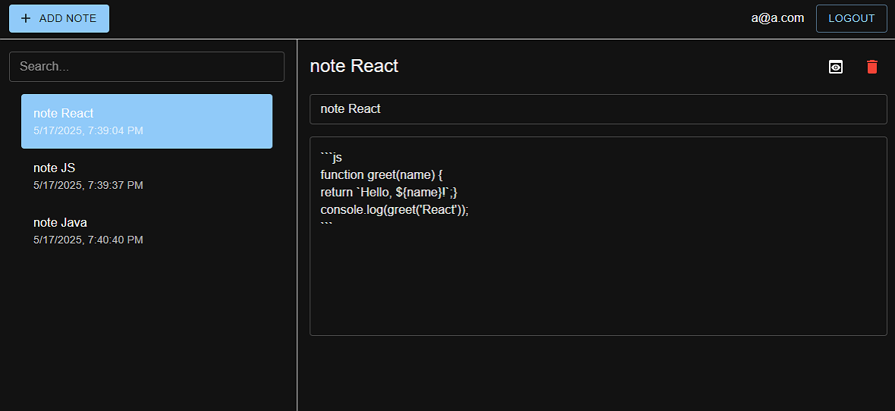
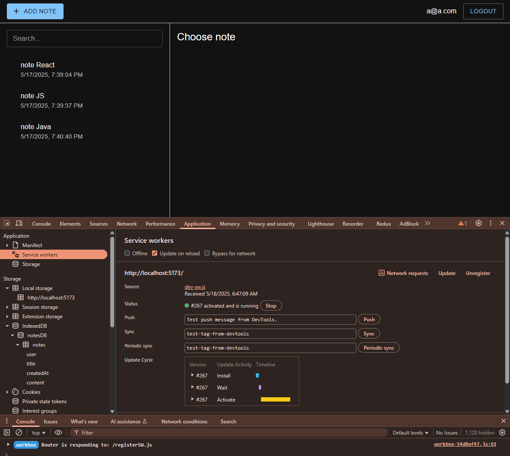

# React Module 2 PWA

## Project: Note

#### [moby home page]

#### [moby create page]

#### [home page]

#### [register page]

#### [log in page]

#### [log in page]

#### [add 1 page]

#### [add 2 page]

#### [add 3 page]

#### [edit page]

#### [list page]

#### [search page]

#### [manifest]

#### [sw]

#### [local storage]

#### [db]

